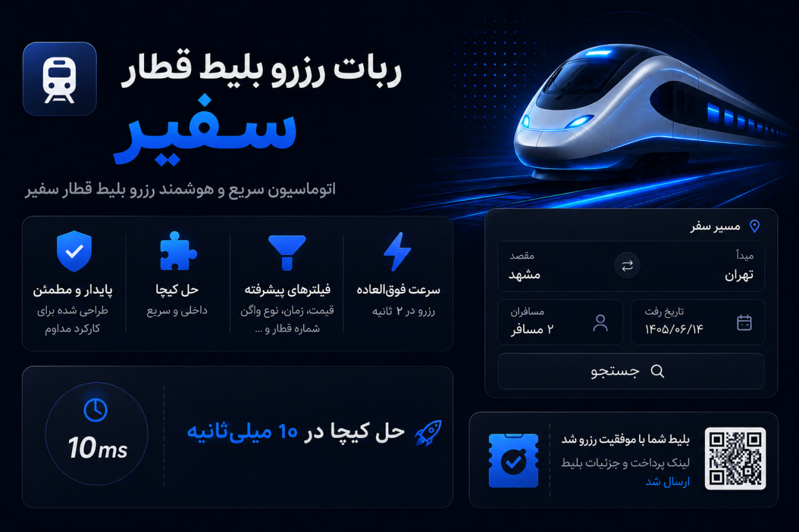

# ربات رزرو بلیط قطار سفیر ریل 2027

  

  <b>⚡ حل کپچا حدود 10 میلی‌ثانیه · رزرو حدود 2 ثانیه · فیلتر هوشمند · اجرای مداوم</b>

ربات **رزرو خودکار بلیط قطار سفیر ریل** برای جستجو، انتخاب و رزرو سریع بلیط در لحظه بازشدن ظرفیت طراحی شده است.

## 🎬 ویدئوی عملکرد

  

---

## 🚀 نسل جدید ربات

### ⚡ سرعت بالا
- حل کپچا به‌صورت **کاملاً داخلی** و بدون وابستگی به سرویس خارجی
- زمان پردازش کپچا حدود **10 میلی‌ثانیه** در تست‌های داخلی
- آماده برای شروع سریع عملیات در لحظه بازشدن ظرفیت
- مناسب برای رقابت روی ظرفیت‌هایی که در چند ثانیه تکمیل می‌شوند

### 🤖 رزرو کاملاً خودکار
- ورود خودکار به حساب کاربری سفیر ریل
- جستجوی پیوسته و خودکار قطار
- بررسی ظرفیت و انتخاب بهترین گزینه مطابق تنظیمات
- پشتیبانی از سفر **یک‌طرفه** و **رفت‌وبرگشت**
- رزرو بلیط و آماده‌سازی لینک پرداخت
- ارسال نتیجه رزرو از طریق Rubika

## 🎯 فیلتر و انتخاب هوشمند قطار

برای مسیر رفت و برگشت می‌توان تنظیمات را **کاملاً مستقل** تعریف کرد.

- شماره قطار
- بازه ساعت حرکت
- محدوده قیمت
- نوع واگن: کوپه‌ای یا سالنی
- تعداد ستاره واگن
- ظرفیت کوپه: ۲، ۴ یا ۶ تخته
- کوپه دربست
- مرتب‌سازی بر اساس:
  - بیشترین / کمترین ظرفیت خالی
  - کمترین / بیشترین قیمت
  - زودترین / دیرترین ساعت حرکت

اگر فیلتر خاصی فعال نباشد، سیستم همچنان نتایج قابل رزرو را هوشمندانه اولویت‌بندی می‌کند.

## 🖥 پنل هوشمند پیکربندی

نسخه جدید پنل برای تنظیم سریع و بدون خطای سفارش بازطراحی شده است.

- رابط کاربری ساده و Dark Mode
- انتخاب مبدا و مقصد
- تقویم شمسی برای تاریخ رفت و برگشت
- انتخاب نوع سفر
- انتخاب جنسیت و کوپه دربست
- تعریف بزرگسال، کودک و نوزاد
- فرم مجزای اطلاعات هویتی هر مسافر
- ثبت وعده غذایی برای رفت و برگشت
- اعتبارسنجی اطلاعات

  

## 🔁 رزروهای متوالی و چند سفارش

ربات برای اجرای مداوم و سفارش‌های پرتعداد طراحی شده است.

- اجرای چند کانفیگ مستقل
- پشتیبانی از رزروهای متوالی
- امکان ادامه رزروهای بعدی روی شماره قطار انتخاب‌شده در سفارش اول
- مناسب برای رزرو چند مسافر یا چند سفارش مرتبط
- طراحی‌شده برای مانیتورینگ طولانی‌مدت ظرفیت

## 📲 اطلاع‌رسانی Rubika

پس از موفقیت در رزرو، اطلاعات لازم مستقیماً ارسال می‌شود:

- حساب کاربری استفاده‌شده
- مشخصات مسافر اصلی
- شماره قطار و نوع واگن
- تاریخ و ساعت حرکت
- مسیر سفر
- لینک پرداخت اینترنتی

ارسال پیام به **گفتگوی شخصی، گروه یا کانال** امکان‌پذیر است.

## ⚡ مقایسه عملکرد نسخه جدید

| بخش | نسخه قبلی | نسخه جدید |
|---|---|---|
| CAPTCHA | وابسته به سرویس خارجی | **پردازش کاملاً داخلی** |
| زمان CAPTCHA | معمولاً چند ثانیه و گاهی بیشتر | **حدود 10 میلی‌ثانیه در تست‌های داخلی** |
| آمادگی هنگام بازشدن ظرفیت | وابسته به زمان پاسخ سرویس | **طراحی‌شده برای واکنش سریع** |
| پنل تنظیمات | ساده | **هوشمند و دارای فیلتر و اعتبارسنجی پیشرفته** |
| انتخاب قطار | فیلترهای پایه | **فیلتر و مرتب‌سازی هوشمند** |

> نتایج سرعت بر اساس تست‌های عملی توسعه‌دهنده ثبت شده‌اند. زمان واقعی می‌تواند با توجه به کیفیت اینترنت، بار سامانه سفیر ریل و شرایط سرویس متفاوت باشد.

---

## 📞 تماس

- **Telegram:** [t.me/parhamkhani](https://t.me/parhamkhani)
- **Email:** parhamkhani.ir@gmail.com
- **Website:** [parhamkhani.ir](https://www.parhamkhani.ir)

---

**ربات رزرو بلیط قطار سفیر ریل · خرید خودکار بلیط قطار · SafirRail Booking Bot · Train Ticket Booking Automation**
